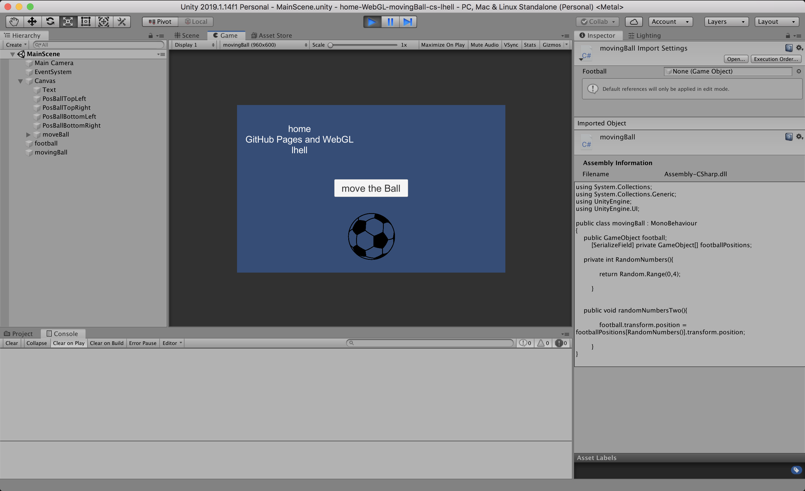

# Unity2019114f1-2D-Template

### Project description: 
Moving a Ball into a random Position by pushing a button

### Development platform: 
macOS High Sierra, Unity 2019.1.14f1, Brackets 1.10

### Target platform: 
WebGL incl. reference resolution 960x600

### Visuals: 

### Third party material: 

### Project state: 
when pushing the button the ball moves, but there is no WebGL yet
 

Copyright by lhell